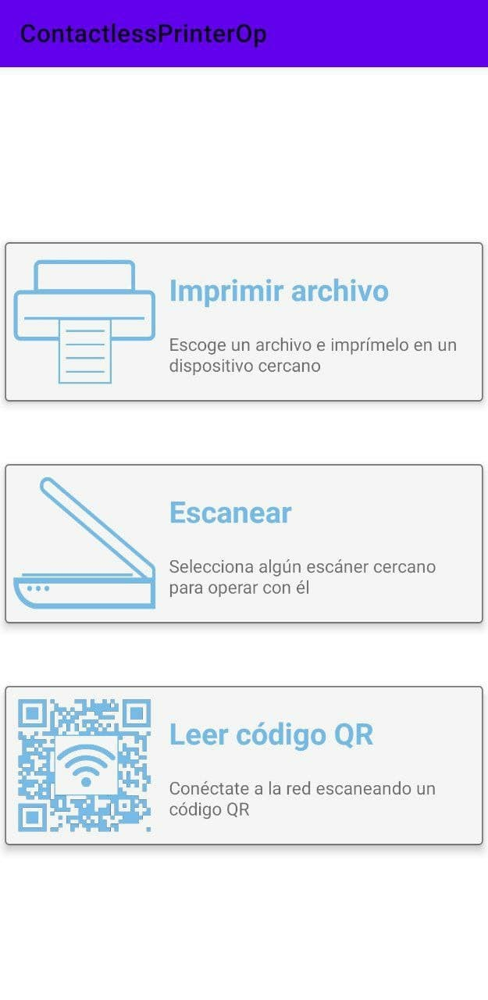
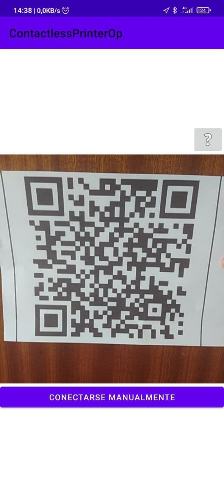
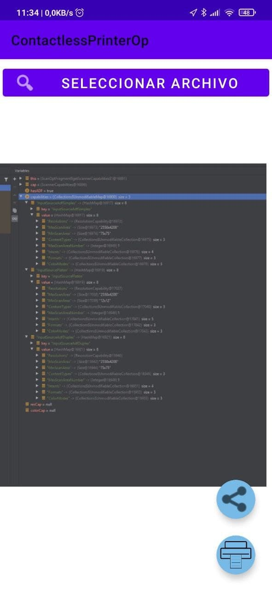
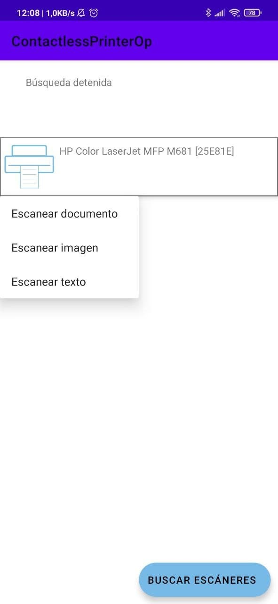
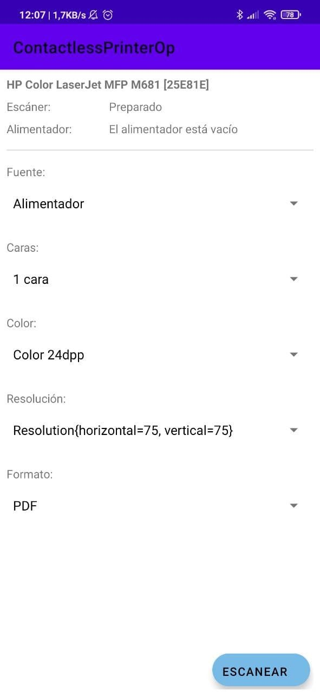
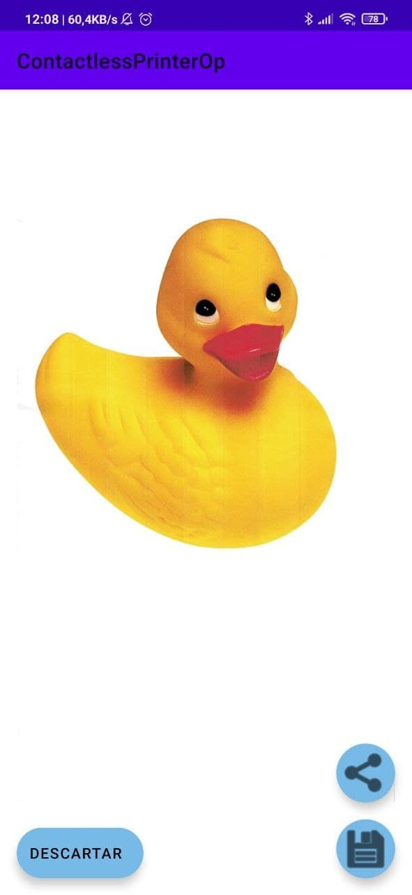

# Arquitectura de la aplicación

El código de la aplicación se ha agrupado siguiendo los principales componentes de la aplicación, por lo que hay un paquete donde se agrupan las clases relacionadas para la funcionalidad de imprimir, otro para las relacionadas con la función de escanear y otro para las relacionadas con la conexión a la red a través del código QR.

## Lectura QR

Formado por la clase ReadQrActivity.kt. Utiliza el detector de de codigos de barras de Google ([link](https://developers.google.com/ml-kit/vision/barcode-scanning)). Además, la conexion a la red es distinta dependiendo de si el dispositivo ya que a partir de Android 10 es diferente.

## Imprimir archivos

La clase principal es PrintActivity.kt que infla el fragmento. Se utiliza un layout propio ZoomLayout.kt que detecta gestos para hacer zoom siempre que el archivo elegido sea una imagen (si es pdf se usa una libreria externa). Dispone de un listener de la librería PickiT que edvuelve la ruta de un archivo cuando se selecciona desde el explorador de archivos.

## Escanear archivos

Sobre la clase ScanActivity.ky se inflan 2 fragmentos. El primero es ScannerSearchFragment.kt, con el cual se buscan escáneres en la red y se listan. Al seleccionar uno se infla el segundo fragmento ScanSettingsFragment, donde se obtienen las características del escáner utilizando la librería Mobile Scan SDK de HP. Al seleccionar las opciones, se validan contra el escaner y se escanea, guardando los resultados en una carpeta temporal. Cuando se completa, los resultados se muestran en la actividad ScanActivity.kt, y se pueden guardar definitivamente o descartarlos eliminando los temporales.

 

# Manual de usuario

## Nociones básicas
Al iniciar la aplicación, se muestra la pantalla principal. En ella se muestran 3 botones correspondientes a las 3 principales funcionalidades de la aplicación.
Al utilizar cada una de ellas, se pedirán algunos permisos al usuario, como puede ser el acceso a la cámara o a los archivos guardados. Si los permisos se rechazan un número determinado de veces fijado por la versión de Android que se utilice, tendrán que ser concedidos a través del gestor de permisos del sistema. Además, al rechazar los permisos, la aplicación volverá a ésta pantalla principal automáticamente.
 

## Conexión a la red escaneando un código QR
Pulsando sobre este botón, se abrirá una pantalla y directamente se piden los permisos de acceso a la cámara. 
 
Una vez se otorguen, se mostrará por la pantalla lo que se esté percibiendo con la cámara.
Al detectar un código QR, si no contiene información sobre una red, se mostrará un mensaje indicándolo. Si el código era correcto, el dispositivo vibrará y se comprobará que el Wifi del dispositivo está encendido, de forma que si está apagado se podrá encender mediante un diálogo dependiente de la versión de Android del dispositivo.
  
Al leerlo, dependiendo de la versión, se conectará directamente a la red en dispositivos Android 9 o inferior. En Android 10 o superior, aparecerá una notificación en la barra de notificaciones que permite guardar la información de la red, yes el dispositivo el que elige a qué red conectarse automáticamente.
 
Por último, debido a que la conexión a la red puede no ser instantánea como se ha explicado con las versiones más modernas de Android, se podrá pulsar el botón determinado para conectarse manualmente, el cual lleva a la pantalla de configuración del Wifi del dispositivo.
 

## Impresión de archivos
Pulsando el botón de imprimir un archivo abre una pantalla con tres botones, uno para seleccionar un archivo, otro para compartir el archivo seleccionado, y otro para mandarlo a una cola de impresión. Si se pulsan los dos últimos botones sin haber elegido un archivo, aparecerá un diálogo indicando que ha de seleccionarse uno. Una vez seleccionado, se previsualiza, permitiendo hacer zoom sobre él.
 
Si se selecciona un archivo con un formato que la aplicación no soporta, se muestra un diálogo indicándolo y explicando cuales son los formatos posibles.
 
Cuando se tenga el archivo preparado y se pulse el botón de imprimir, se abrirá el servicio de impresión proporcionado por el sistema, el cuál detecta las impresoras que hay en la red y permite cambiar la configuración de la impresión.
 
Finalmente, mientras dure la impresión, el sistema muestra el progreso en la barra de notificaciones del dispositivo.
 

## Escaneo de archivos
Al pulsar sobre el botón de escaneo, se abrirá una nueva pantalla con un botón de buscar escáneres, y al encontraros se mostrarán en una lista. Es obligatorio que el escáner y el teléfono estén conectados a la misma red Wifi.
Al seleccionar un escáner, se abre un menú con tres opciones: Escanear documento, imagen o texto. Esto crea ajustes preestablecidos que favorecen el tipo de escaneo que quiere realizarse, de forma que escanear imagen favorece escanear una hoja con una foto, escanear texto favorece una hoja con solo texto, y escanear documento faciliza escanear hojas donde hay texto e imágenes combinados.

Una vez seleccionado el tipo de escaneo que quiere realizarse, se abre una pantalla con las características del escáner.
En la parte superior, se muestra el nombre del escáner, su estado, y el estado del alimentador si dispone de él. Debajo aparece la configuración que puede cambiarse, recibida del proprio escáner.
 
Una vez seleccionadas las opciones preferidas se ha de pulsar el botón de escanear. En este momento, la aplicación valida las opciones con el escáner, y si no son válidas, se muestra un mensaje de advertencia y se permite cambiarlas. Si son correctas, se muestra un diálogo de carga mientras se muestre el escaneo, mostrado también la causa de un error en caso de que alguno ocurra. Además, se puede detener el escaneo borrando todos los archivos temporales que se hayan podido crear en el proceso.

Cuando se hayan escaneado todas las hojas, se mostrará una pantalla previsualizando el resultado. En este momento los archivos son todavía temporales, por lo que se permiten descartarse, guardarse definitivamente o compartirse por email según se requiera. Tras guardarse o descartarse, si hay mas archivos que previsualizar, se mostrarán automáticamente. Si no, se muestra un diálogo indicando que no hay más y la aplicación vuelve a la pantalla principal.

